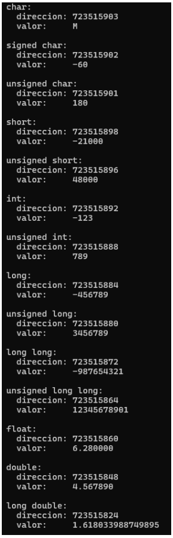

# Actividad 01: Tipos de Datos

## 📋 Descripción

Programa que declara, inicializa e imprime los principales tipos de datos primitivos del lenguaje C, mostrando su dirección de memoria y valor asignado.

## 🎯 Temas aplicados

- Tipos de datos
- printf
- Direcciones de memoria

## 💻 Código fuente

Ver archivo: [TiposDatos.c](./Codigo/TiposDatos.c)

## 📸 Evidencias de funcionamiento



## 📄 Documentación adicional

Ver PDF: [TiposDatos.pdf](./Documentacion/TiposDatos.pdf)

## 🖥️ Compilación

```bash
gcc Codigo/TiposDatos.c -o tipos_datos
```

## ▶️ Ejecución

```bash
./tipos_datos
```

---

[Volver al inicio](../)
